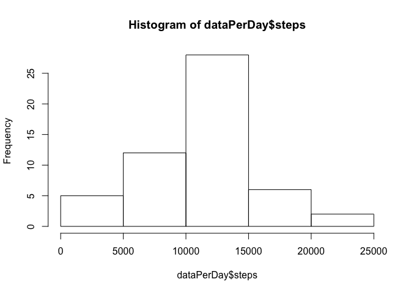
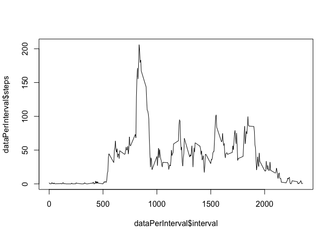
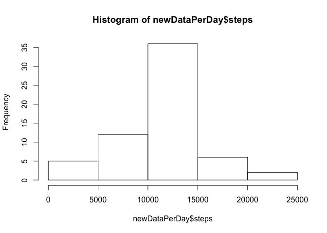
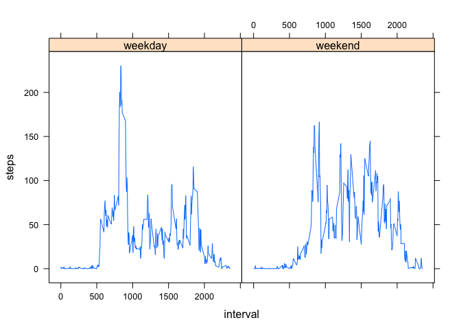

# Reproducible Research: Peer Assessment 1


## Loading and preprocessing the data
Below is the code for loading the data from the csv into a data frame in r as well as explicitly formatting the date column to the dateformat .

```r
      library(dplyr)
```

```
## 
## Attaching package: 'dplyr'
## 
## The following object is masked from 'package:stats':
## 
##     filter
## 
## The following objects are masked from 'package:base':
## 
##     intersect, setdiff, setequal, union
```

```r
      data <- read.csv("activity.csv")
      data$date <- as.Date(data$date, "%Y-%m-%d")
      dataPerDay <- group_by(data, date)
      dataPerDay <- summarise_each(dataPerDay , funs(sum))
      dataPerInterval <- group_by(data, interval)
      dataPerInterval <- summarise_each(dataPerInterval , funs(mean(., na.rm = TRUE)))
```

## What is mean total number of steps taken per day?
In the section below the total number of steps is calculated, a histogram drawn of the steps per day and the mean and median of steps per day output

```r
      sum(dataPerDay$steps, na.rm = TRUE)
```

```
## [1] 570608
```

```r
      hist(dataPerDay$steps)
```

 

```r
      stats <- summary(dataPerDay$steps)
```
The mean of the steps data is 1.077\times 10^{4} and the median is 1.076\times 10^{4}

## What is the average daily activity pattern?
Below is a plot of the activity output in 5 minute intervals

```r
      plot(dataPerInterval$interval, dataPerInterval$steps, type = "l")
```

 

```r
      maxInt = filter(dataPerInterval, dataPerInterval$steps == max(dataPerInterval$steps))
```
The interval with the maximum number of steps on average across all days is interval 835

## Imputing missing values
Below is the code used to evaluate the status of the missing data as well as the method used for filling in the NA values by creating a new data set and anlysisng the esult using a histogram

```r
      nadata <- data[is.na(data),]
      newData <- data
      for (i in 1:nrow(newData)){
           if (is.na(newData[i,1])){
                 for (j in 1:nrow(dataPerInterval)){
                       if (dataPerInterval[j, 1] == newData[i, 3]){
                             newData[i,1] = dataPerInterval[j, 2] 
                       }
                 }
           } 
            
      }
      newDataPerDay <- group_by(newData, date)
      newDataPerDay <- summarise_each(newDataPerDay , funs(sum))
      hist(newDataPerDay$steps)
```

 

```r
      statNewData <- summary(newDataPerDay$steps)
```

The number of NA rows in the dataset is 2304
The mean of the steps data with imputed values for missing values os is 1.077\times 10^{4} and the median is 1.077\times 10^{4}. Where as previously they were1.077\times 10^{4}, 1.076\times 10^{4}, respectfully.

## Are there differences in activity patterns between weekdays and weekends?

Below is the code for adding another column to check if it is a weekday or weekend


```r
      library(chron)
      newData <- mutate(newData, weekday = 
      ifelse(is.weekend(date), "weekend", "weekday")) 
      newDataPerInterval <- group_by(newData, weekday, interval)
      newDataPerInterval <- summarise_each(newDataPerInterval , funs(mean(., na.rm = TRUE)))
      library(lattice)
      xyplot(steps~interval | weekday , data = newDataPerInterval, type = "l")
```

 
